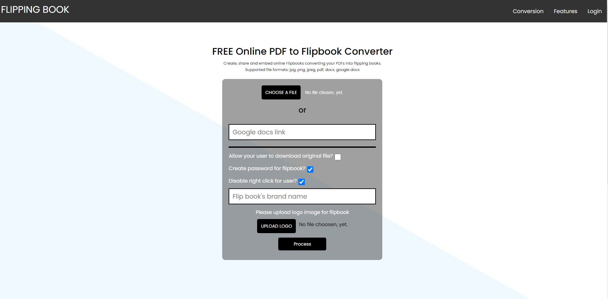

# The browser files conventer

This app convent the .docx, .pdf, .jpg/.png/.webp files into .pdf files 
and show them in the browser linking the user that uploaded it

created by flask/python (as server app), js/jquery (as front-end)

for authorization app uses the tokens for each user

app has the admin panel by the url /administrator (base username/password can be found in server/config.py)

for test the functionality: create the user in admin panel, after that login user in front-end and
create the flipbook by form